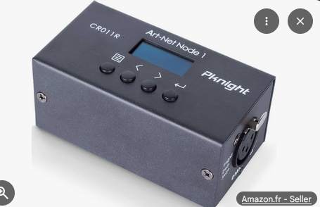
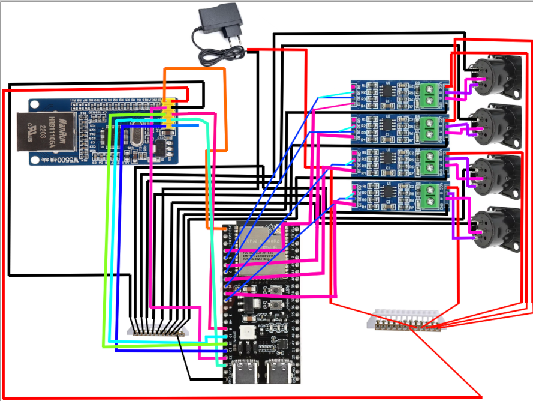
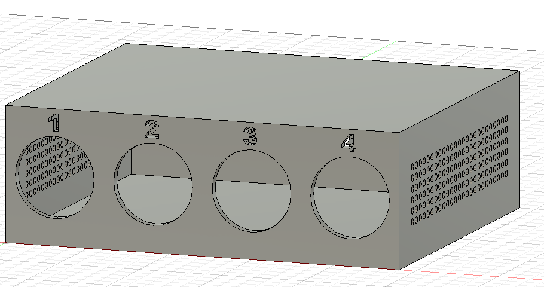
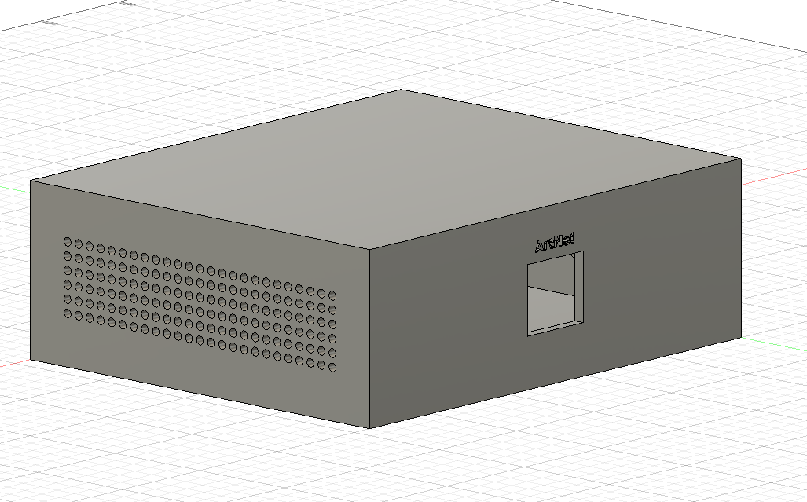
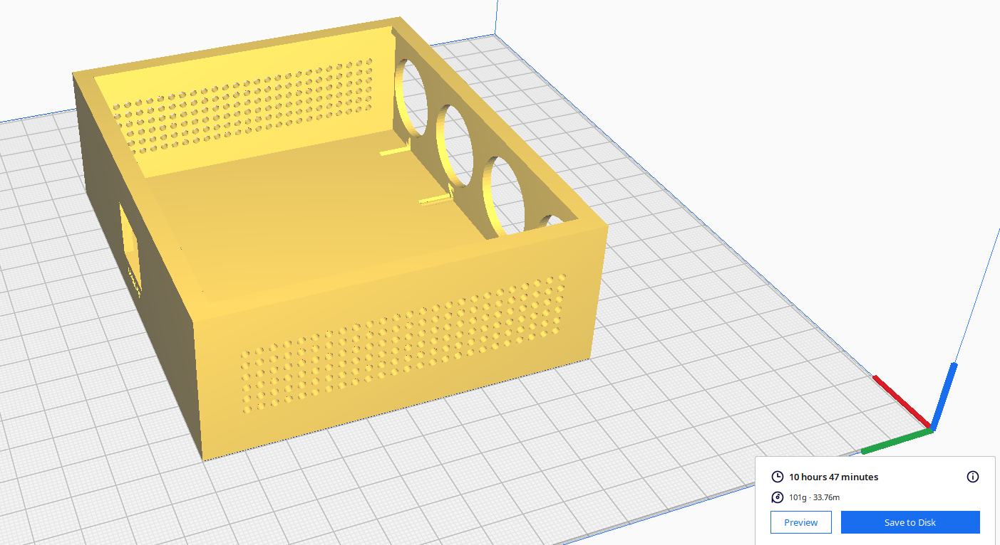

# June 17: Defining system & BOM test
I would like to create a system base on ESP with two main component:
-> DMX Interface
-> Ethernet Interface



Management of 4 universe is good so we need 4 DMX interface and software for distribute DMX to good interface

This Interface need to be compaptible with QLC+ for DMX Management with ArtNet difusion on 4 universe.

I've work on my BOM with all documentation, choice of ESP32-S3 to management better and efficency 4 universe.

**Preview BOM:**
-> W5500 (https://fr.aliexpress.com/item/1005009353017777.html) = 3,89€
-> 4 * MAX485 Module RS-485 (https://fr.aliexpress.com/item/1005007011742123.html) = 0.83€ * 4 = 3,32€
-> ESP32-S3 (https://fr.aliexpress.com/item/1005012092039320.html) = 5.69€
-> 4 * XLR 3Pin Panel Mount Connectors Female (https://fr.aliexpress.com/item/1005008919369057.html) = 4.19€
-> 5V 2A Alimentation (https://fr.aliexpress.com/item/1005005539475429.html) = 2.99€
-> 2 * 12 Holes Bridge (https://fr.aliexpress.com/item/1005001742109041.html) = 2 * 1,37€ = 4,74€

I will made a little box in PLA with my 3D Printer for put all component but no PCB needed for this project, I have cable at home for this project.

**Total time spent: 3 hours**

# June 18: Electric scheme
I made electrical scheme with all component:


For a total of 24,82€ arround $28,55

One of my actual question is on Alimentation (Jack at the base) but I will try to cut the cable and sort +5V and GND cable from this

I spend lot of time in my scheme (ChatGPT fail for response me with the PIN of W5500 and no technical docs ?)

**Total time spent: 2 hours**

# June 19: Casing in fusion 360
Beautiful casing made on Fusion 360:



This case sliced:


101g of 3d filament + bottom plate for finish the build (I need 250g of filament from forge I will make demand for this)

**Total time spent: 2 hours**

# June 20: Development
I made the code of my project (Help with AI for debug):
```c
#include <SPI.h>
#include <Ethernet_Generic.h>
#include <ArtnetWifi.h>
#include <ESP32DMX.h>

#define W5500_CS 10

byte mac[] = {
  0xDE, 0xAD, 0xBE, 0xEF, 0xFE, 0x01
};

IPAddress ip(192, 168, 1, 50);

#define DMX1_TX 4
#define DMX2_TX 5
#define DMX3_TX 6
#define DMX4_TX 7

ESP32DMX dmx1;
ESP32DMX dmx2;
ESP32DMX dmx3;
ESP32DMX dmx4;

uint8_t universe0[512];
uint8_t universe1[512];
uint8_t universe2[512];
uint8_t universe3[512];

ArtnetWifi artnet;


void onDmxFrame(uint16_t universe, uint16_t length, uint8_t sequence, uint8_t* data){
  switch (universe)
  {
    case 0:
      memcpy(universe0, data, length);
      for(int i=0;i<length;i++)
        dmx1.write(i + 1, data[i]);
      break;
    case 1:
      memcpy(universe1, data, length);
      for(int i=0;i<length;i++)
        dmx2.write(i + 1, data[i]);
      break;
    case 2:
      memcpy(universe2, data, length);
      for(int i=0;i<length;i++)
        dmx3.write(i + 1, data[i]);
      break;
    case 3:
      memcpy(universe3, data, length);
      for(int i=0;i<length;i++)
        dmx4.write(i + 1, data[i]);
      break;
  }
}

void setup()
{
  Serial.begin(115200);
  Serial.println("DMX Interface Starting");
  Ethernet.init(W5500_CS);
  Ethernet.begin(mac, ip);
  Serial.print("IP: ");
  Serial.println(Ethernet.localIP());
  dmx1.init(DMX1_TX);
  dmx2.init(DMX2_TX);
  dmx3.init(DMX3_TX);
  dmx4.init(DMX4_TX);
  artnet.begin();
  artnet.setArtDmxCallback(onDmxFrame);
  Serial.println("ArtNet Ready");
}

void loop()
{
  artnet.read();
}
```

It's works for compil but I have trouble with my dev ESP card at home, I search for issue but find nothing, it's can be in ESP32DMX lib 

For config in QLC+:

Cable ethernet with PC and config QLC with this:

Output: ArtNet
IP: Ethernet.localIP()
Universe 0 -> DMX OUT 1
Universe 1 -> DMX OUT 2
Universe 2 -> DMX OUT 3
Universe 3 -> DMX OUT 4

**Total time spent: 2 hours**