# June 17: Defining system & BOM test
I would like to create a system base on ESP with two main component:
-> DMX Interface
-> Ethernet Interface

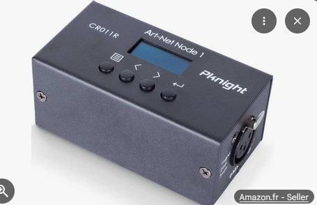

Management of 4 universe is good so we need 4 DMX interface and software for distribute DMX to good interface

This Interface need to be compaptible with QLC+ for DMX Management with ArtNet difusion on 4 universe.

I've work on my BOM with all documentation, choice of ESP32-S3 to management better and efficency 4 universe.

**Preview BOM:**
-> W5500 (https://fr.aliexpress.com/item/1005009353017777.html) = 3,89€
-> 4 * MAX485 Module RS-485 (https://fr.aliexpress.com/item/1005007011742123.html) = 0.83€ * 4 = 3,32€
-> ESP32-S3 (https://fr.aliexpress.com/item/1005012092039320.html) = 5.69€
-> 4 * XLR 3Pin Panel Mount Connectors Female (https://fr.aliexpress.com/item/1005008919369057.html) = 4.19€
-> 5V 2A Alimentation (https://fr.aliexpress.com/item/1005005539475429.html) = 2.99€
-> 2 * 12 Holes Bridge (https://fr.aliexpress.com/item/1005001742109041.html) = 2 * 1,37€ = 4,74€

I will made a little box in PLA with my 3D Printer for put all component but no PCB needed for this project, I have cable at home for this project.

**Total time spent: 3 hours**

# June 18: Electric scheme
I made electrical scheme with all component:
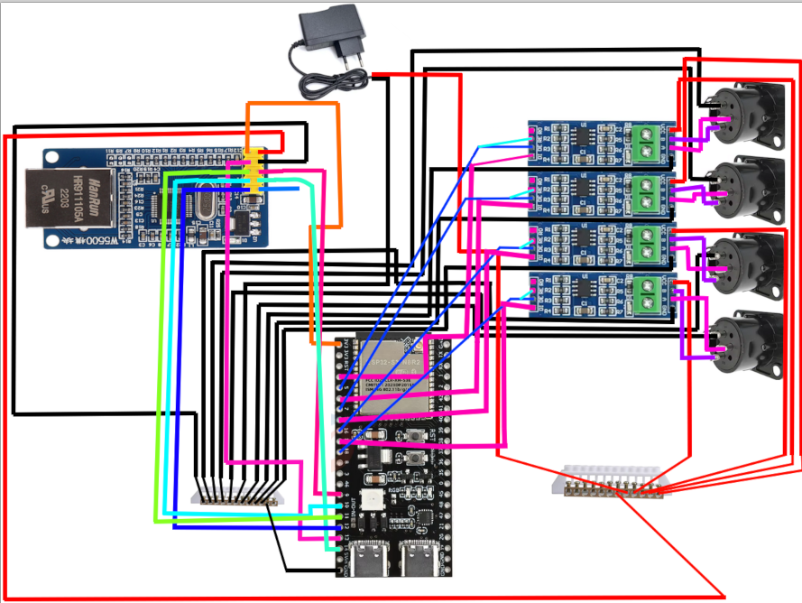

For a total of 24,82€ arround $28,55

One of my actual question is on Alimentation (Jack at the base) but I will try to cut the cable and sort +5V and GND cable from this

I spend lot of time in my scheme (ChatGPT fail for response me with the PIN of W5500 and no technical docs ?)

**Total time spent: 2 hours**

# June 19: Casing in fusion 360
Beautiful casing made on Fusion 360:
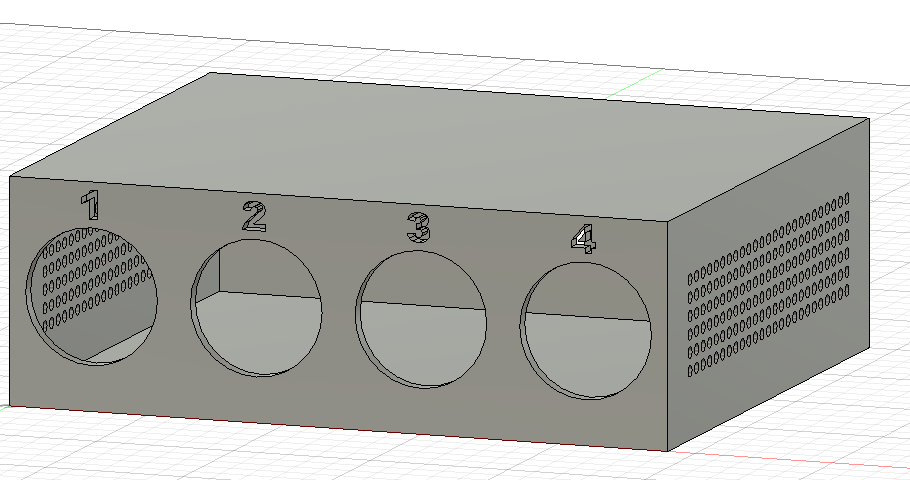
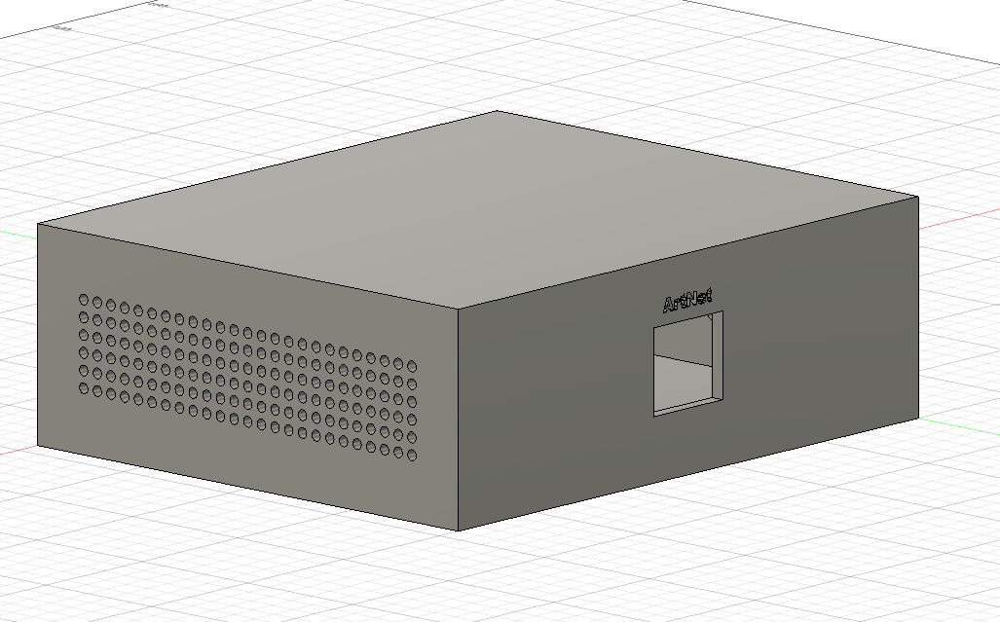

This case sliced:
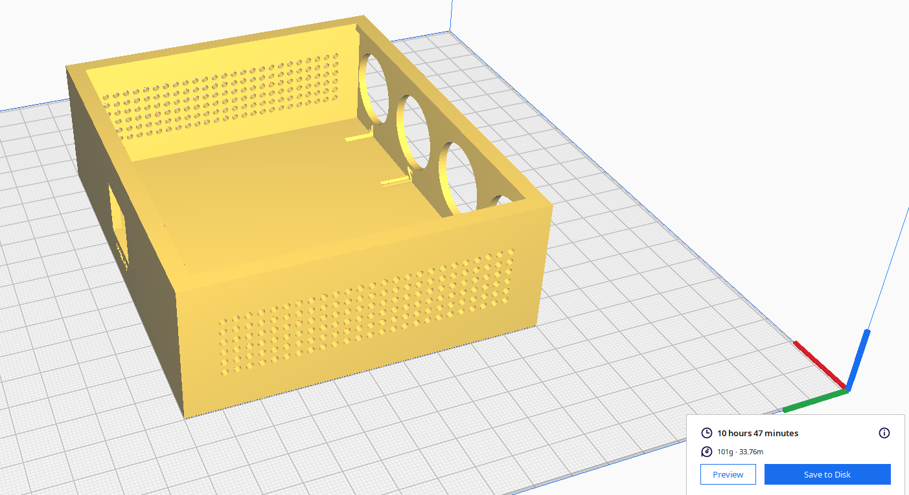

101g of 3d filament + bottom plate for finish the build (I need 250g of filament from forge I will make demand for this)

**Total time spent: 2 hours**

# June 20: Development
I made the code of my project (Help with AI for debug):
```c
#include <SPI.h>
#include <Ethernet_Generic.h>
#include <ArtnetWifi.h>
#include <ESP32DMX.h>

#define W5500_CS 10

byte mac[] = {
  0xDE, 0xAD, 0xBE, 0xEF, 0xFE, 0x01
};

IPAddress ip(192, 168, 1, 50);

#define DMX1_TX 4
#define DMX2_TX 5
#define DMX3_TX 6
#define DMX4_TX 7

ESP32DMX dmx1;
ESP32DMX dmx2;
ESP32DMX dmx3;
ESP32DMX dmx4;

uint8_t universe0[512];
uint8_t universe1[512];
uint8_t universe2[512];
uint8_t universe3[512];

ArtnetWifi artnet;


void onDmxFrame(uint16_t universe, uint16_t length, uint8_t sequence, uint8_t* data){
  switch (universe)
  {
    case 0:
      memcpy(universe0, data, length);
      for(int i=0;i<length;i++)
        dmx1.write(i + 1, data[i]);
      break;
    case 1:
      memcpy(universe1, data, length);
      for(int i=0;i<length;i++)
        dmx2.write(i + 1, data[i]);
      break;
    case 2:
      memcpy(universe2, data, length);
      for(int i=0;i<length;i++)
        dmx3.write(i + 1, data[i]);
      break;
    case 3:
      memcpy(universe3, data, length);
      for(int i=0;i<length;i++)
        dmx4.write(i + 1, data[i]);
      break;
  }
}

void setup()
{
  Serial.begin(115200);
  Serial.println("DMX Interface Starting");
  Ethernet.init(W5500_CS);
  Ethernet.begin(mac, ip);
  Serial.print("IP: ");
  Serial.println(Ethernet.localIP());
  dmx1.init(DMX1_TX);
  dmx2.init(DMX2_TX);
  dmx3.init(DMX3_TX);
  dmx4.init(DMX4_TX);
  artnet.begin();
  artnet.setArtDmxCallback(onDmxFrame);
  Serial.println("ArtNet Ready");
}

void loop()
{
  artnet.read();
}
```
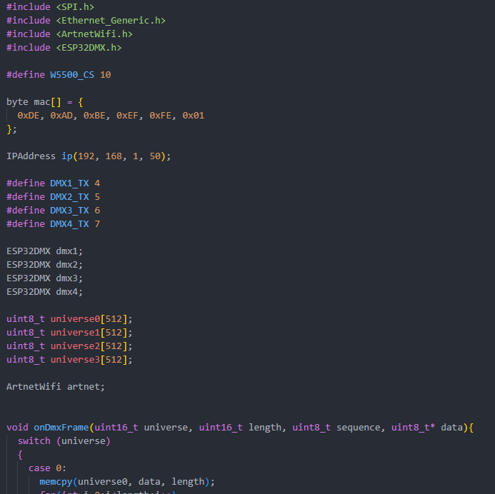
It's works for compil but I have trouble with my dev ESP card at home, I search for issue but find nothing, it's can be in ESP32DMX lib 

For config in QLC+:

Cable ethernet with PC and config QLC with this:

Output: ArtNet
IP: Ethernet.localIP()
Universe 0 -> DMX OUT 1
Universe 1 -> DMX OUT 2
Universe 2 -> DMX OUT 3
Universe 3 -> DMX OUT 4

**Total time spent: 2 hours**

# July 18 & 19: Response about changes needed
I receive this message:
Hey, nice project and amazing effort, but there is few things to fix before getting approved!

    You need to have solid way to mount the electronic components inside your case. Try designing holder OR make holes in your case so you can use screws and nuts to mount them.
    Regarding schematics, you have connected the red wire from the external power adapter directly to the ESP32’s 3V3 pin. This will send too much voltage (5V+) into the ESP32’s internal 3.3V line, which could destroy the main chip. Try connecting it to 5V.


So two problems:
- schematic with 5V injected in ESP
- casing with no block system for card

For solution of first problem:
An idea is to change the card ESP-C3 to ESP-WROOM-32, I test at home, it's works, for 5.89€ so it's lower than ESP-C3 and 5V pin are here ...

So new BOM:

| Catégorie     | Article                                | Quantité | Prix unitaire (€) | Prix total (€) | Notes                | URL                                                                                                          |
| ------------- | -------------------------------------- | -------: | ----------------: | -------------: | -------------------- | ------------------------------------------------------------------------------------------------------------ |
| Communication | W5500                                  |        1 |              3.89 |           3.89 |                      | [https://fr.aliexpress.com/item/1005009353017777.html](https://fr.aliexpress.com/item/1005009353017777.html) |
| Communication | MAX485 Module RS-485                   |        4 |              0.83 |           3.32 |                      | [https://fr.aliexpress.com/item/1005007011742123.html](https://fr.aliexpress.com/item/1005007011742123.html) |
| Controls      | ESP32-WROOM-32                         |        1 |              5.89 |           5.89 |                      | [https://fr.aliexpress.com/item/1005012697513614.html](https://fr.aliexpress.com/item/1005012697513614.html) |
| Connectique   | XLR 3Pin Panel Mount Connectors Female |        4 |              1.05 |           4.19 | Lot de 4 connecteurs | [https://fr.aliexpress.com/item/1005008919369057.html](https://fr.aliexpress.com/item/1005008919369057.html) |
| Power         | Alimentation 5V 2A                     |        1 |              2.99 |           2.99 |                      | [https://fr.aliexpress.com/item/1005005539475429.html](https://fr.aliexpress.com/item/1005005539475429.html) |
| Prototype     | 12 Holes Bridge                        |        2 |              2.37 |           4.74 |                      | [https://fr.aliexpress.com/item/1005001742109041.html](https://fr.aliexpress.com/item/1005001742109041.html) |
| **TOTAL**     |                                        |          |                   |      **25.02** |                      |                                                                                                              |


New scheme:
[Scheme](assets\DMXInterface.pdn)

I made this for block ESP-WROOM-32
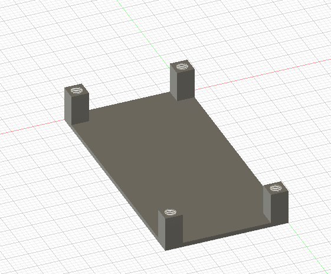

This for block MAX485
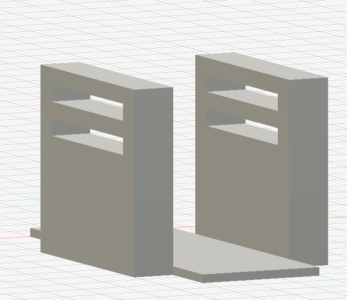

This is monting on assembly
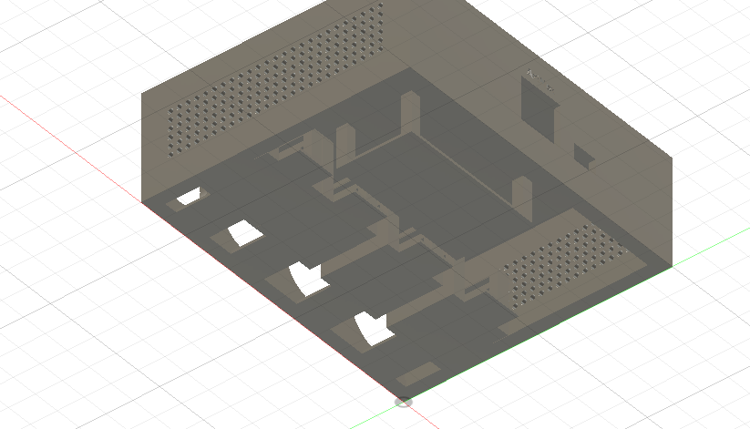

**Total time spent: 3.5 hours**


# New response !
I have received this message:
"Hi, this is a cool project, and the idea is really interesting, but it needs some polishing before we can accept it! It doesn't have a custom PCB, and that's totally fine, but that means that your case should be a bit more refined. Right now I don't see how the different parts are supposed to stay together, and there's no base on your container! I don't know how much CAD experience you have, but this is a great opportunity to learn it better. I'd love to see a design-optimized case with a removable back panel, easy screw & heatset insert mounts for the esp32 and other components, and maybe even dedicated wire paths and routing helps to make it extra satisfying and easy to set up. Overall, I love the idea, but I'd just like to see it worked through a little more."

3 problems detected in your message:

The container/enclosure does not have a base.
-> 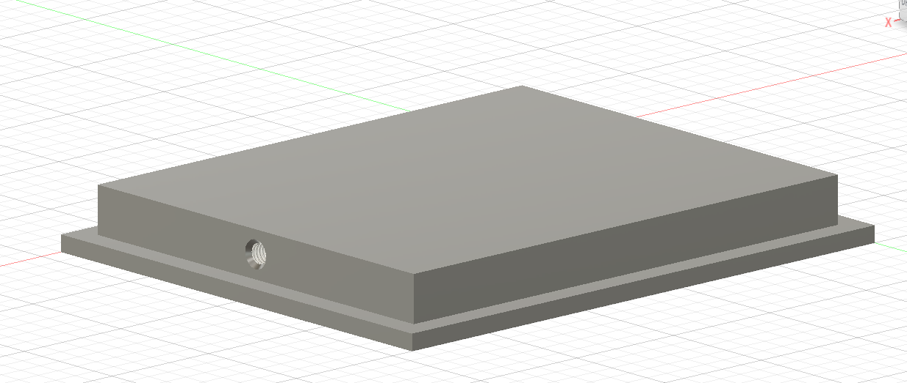
The case design is not refined enough.
-> 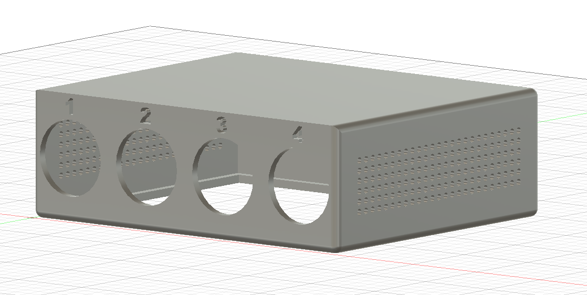 I polish it
No screw mounts or heat-set insert locations are included.
->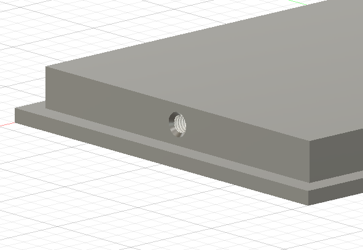
I made hole in my case

I remade render and assembly for this
assets\DMXInterface.step
assets\BottomDMXInterface.step
assets\AssemblageDMXInterface.step

**Total time spent: 2.5 hours**

# New response ! Pt 2
I received:
"Hi! great work, but please add a complete CAD assembly, with all components (including electronics). you can download cad of the components from grab cad and position them to their assigned places, it will help us in finding any issues (if exists). Also please organize the repo, add all the images in a folder, you can also improve your readme formatting (it will greatly improve the looks of your readme), please do the required changes and we will have another look :)"

So problems are:
- Images folder (organisation of repo)
-> Good
- README ameliorations
-> its good
- CAD Assembly files
-> exported :)
- Add mecanic components
-> This is good:
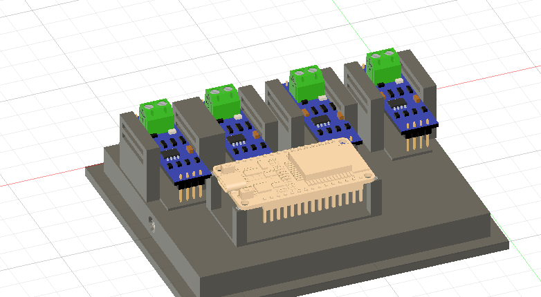

**Total time spent: 0.5 hours**

# New response ! Pt 3
I reveived: 
"Hi! Nice project, but there are a few problems rn that need to be fixed:

    your repo is not organised; it'd be great if you put respective files into their respective folders, such as cad/, firmware/, etc.
    I don't see a way on how you are going to assemble your enclosure.
    The MAX485 module that you are using right now works on 5V logic, but your ESP32 works on 3.3V logic; this will fry your MCU. Please have a voltage divider/level shifter. It'd be better if you used any other 3.3v logic modules, such as those based on MAX3485.
    Not required though, but schematic made in kicad would generally be more easier to read than this one.
"

--> Organisation of repo ==> OK !

--> Assembly ==> I add it
--> MAX485 ==> I changed it to MAX3485 (https://fr.aliexpress.com/item/1005006007545162.html) and update BOM but nothing change on scheme
--> I havent KiCad scheme but now I made one for each project

**Total time spent: 0.5 hours**