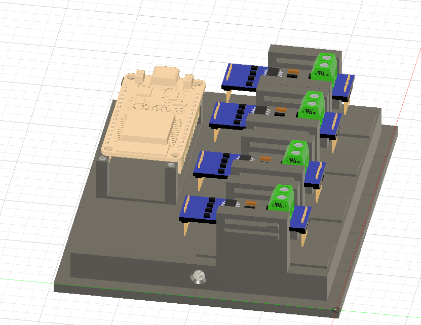
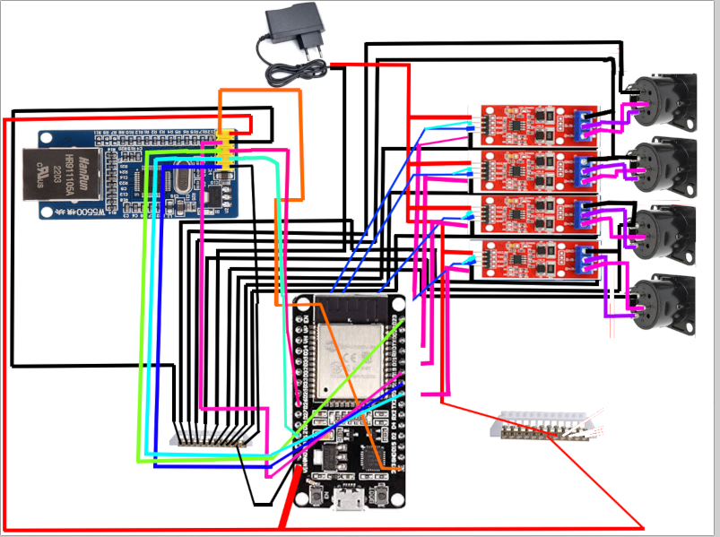

# DMX Interface — ArtNet to DMX Converter

A DIY Ethernet-to-DMX interface designed to convert **Art-Net DMX data into physical DMX512 outputs**.

The project provides a compact, low-cost and reproducible solution capable of controlling **4 independent DMX universes** through an Ethernet connection.

The goal of this project is to create an affordable alternative to commercial Art-Net to DMX interfaces while keeping the hardware simple, easy to assemble and fully customizable.

---

# Overview

## What does this project do?

This interface acts as a bridge between an Ethernet network and DMX lighting equipment.

Instead of connecting a lighting controller directly to a DMX cable, the controller sends DMX data over an Ethernet network using the **Art-Net protocol**.

The interface receives these Art-Net packets, identifies the DMX universe they belong to, and converts the data into a standard **DMX512 signal**.

The four universes are mapped to four physical DMX outputs:

| Art-Net Universe | DMX Output |
| ---------------: | ---------- |
|       Universe 0 | DMX 1      |
|       Universe 1 | DMX 2      |
|       Universe 2 | DMX 3      |
|       Universe 3 | DMX 4      |

Each universe can contain up to **512 DMX channels**.

For example, a lighting software such as QLC+ can send:

```text
Ethernet
   │
   │ Art-Net
   ▼
┌───────────────────────┐
│     DMX Interface     │
│                       │
│  ESP32 + W5500        │
│          │            │
│    Art-Net parser     │
│          │            │
│   ┌──────┼──────┐     │
│   ▼      ▼      ▼ ... │
│ DMX1   DMX2   DMX3    │
└───┬─────┬─────┬───────┘
    │     │     │
    ▼     ▼     ▼
 Lighting fixtures
```

This makes the interface particularly useful for **DMX lighting, stage lighting, DJ setups, architectural lighting and other Art-Net compatible applications**.

---

# Features

* **4 independent DMX universes**
* Art-Net input over Ethernet
* W5500 Ethernet controller
* ESP32-based controller
* RS-485 DMX outputs
* 4 × 3-pin XLR female outputs
* Up to 512 DMX channels per output
* Fully 3D-printable enclosure
* Low-cost components
* Open-source hardware and firmware
* Easy to reproduce
* Compatible with lighting software supporting Art-Net

---

# System Architecture

The interface is composed of several functional blocks.

```text
                 Ethernet Network
                       │
                       │
                    Art-Net
                       │
                       ▼
                ┌─────────────┐
                │    W5500    │
                │  Ethernet   │
                │ Controller  │
                └──────┬──────┘
                       │ SPI
                       ▼
                ┌─────────────┐
                │    ESP32    │
                │             │
                │ Art-Net     │
                │ processing  │
                └──────┬──────┘
                       │
          ┌────────────┼────────────┐
          │            │            │
          ▼            ▼            ▼
       Universe 0   Universe 1   Universe 2   Universe 3
          │            │            │            │
          ▼            ▼            ▼            ▼
       MAX3485      MAX3485      MAX3485      MAX3485
          │            │            │            │
          ▼            ▼            ▼            ▼
        DMX 1        DMX 2        DMX 3        DMX 4
```

## Data flow

The complete process is:

1. A lighting controller sends Art-Net packets through Ethernet.
2. The W5500 receives the Ethernet packets.
3. The ESP32 processes the Art-Net data.
4. The firmware checks the Art-Net universe number.
5. The corresponding DMX universe is selected.
6. The DMX channel values are sent to the appropriate RS-485 transceiver.
7. The transceiver converts the ESP32's logic-level signal into a differential RS-485 signal.
8. The signal is sent through the XLR connector to the lighting fixtures.

For example:

```text
QLC+
 │
 │ Art-Net Universe 2
 ▼
Ethernet
 │
 ▼
W5500
 │
 ▼
ESP32
 │
 ├── Universe 0 → DMX 1
 ├── Universe 1 → DMX 2
 ├── Universe 2 → DMX 3
 └── Universe 3 → DMX 4
                    │
                    ▼
                DMX fixtures
```

---

# Hardware

The complete Bill of Materials is available in:

[BOM.csv](BOM.csv)

The detailed BOM is also available at the end of this document.

## Main components

### ESP32

The ESP32 is the main controller of the interface.

It handles:

* Art-Net packet processing
* Universe identification
* DMX data processing
* Communication with the W5500
* Generation of the four DMX outputs

### W5500

The W5500 provides the Ethernet interface.

It communicates with the ESP32 through **SPI** and allows the interface to receive Art-Net packets through a standard Ethernet connection.

Using a dedicated Ethernet controller also avoids relying on Wi-Fi for the main DMX transport.

### MAX3485

Four MAX3485 RS-485 transceivers are used to generate the physical DMX outputs.

Each transceiver corresponds to one DMX universe.

The ESP32 generates the DMX data and the MAX3485 converts the signal into the differential RS-485 electrical interface required by DMX512.

### XLR connectors

Four female 3-pin XLR connectors provide the physical DMX outputs.

Each connector corresponds to one DMX universe.

---

# Mechanical Design

The enclosure was designed to be **fully 3D printable**.

The objective was to avoid requiring specialized machining or industrial manufacturing equipment.

The enclosure can therefore be reproduced using a standard FDM 3D printer.

## Case


The enclosure contains mounting points for the electronic components and cut-outs for:

* Ethernet connection
* DMX XLR outputs
* Power input
* Other required connections

The exact mechanical design can be modified if different connectors, mounting methods or electronics are used.

---

# CAD Files

The CAD files are provided in STEP format so that the enclosure can be modified using most modern CAD software.



* [Bottom DMX Interface](cad/BottomDMXInterface.step)
* [DMX Interface Enclosure](cad/DMXInterface.step)
* [Assembly](cad/AssemblageDMXInterface.step)

---

# Electronic Design

## Schematic



The electronics are divided into three main sections:

### 1. Ethernet interface

The ESP32 communicates with the W5500 through SPI.

The W5500 handles the Ethernet connection and provides the network interface required for Art-Net.

### 2. Processing

The ESP32 receives Art-Net packets and determines which DMX universe they belong to.

The firmware then forwards the received channel values to the appropriate DMX output.

### 3. DMX outputs

Each DMX output has its own RS-485 transceiver.

This provides four electrically independent DMX interfaces:

```text
ESP32
 │
 ├── TX 1 → MAX3485 → XLR DMX 1
 ├── TX 2 → MAX3485 → XLR DMX 2
 ├── TX 3 → MAX3485 → XLR DMX 3
 └── TX 4 → MAX3485 → XLR DMX 4
```

---

# Building the Interface

Building the interface can be divided into several stages.

## 1. Get the components

Start by obtaining all components listed in [BOM.csv](BOM.csv).

The project intentionally uses commonly available modules rather than custom components wherever possible.

This keeps the project inexpensive and makes replacement parts easy to find.

---

## 2. 3D print the enclosure

Print the enclosure using the provided CAD files.

The exact print settings will depend on the printer and filament being used.

Before assembling the electronics, verify that:

* The XLR connectors fit correctly.
* The Ethernet connector is accessible.
* The power connection is accessible.
* The electronic modules fit inside the enclosure.
* The mounting holes line up correctly.

---

## 3. Assemble the electronics

Install the following modules:

* ESP32
* W5500
* 4 × MAX3485
* Power supply
* XLR connectors
* Prototyping/connection boards

The modules must then be wired according to the schematic.

Pay particular attention to:

* ESP32 GPIO assignments
* SPI connections to the W5500
* TX connections for the four DMX outputs
* 5 V power distribution
* Ground connections
* RS-485 A/B connections
* XLR pin assignments

Do not connect the interface to DMX equipment before verifying the wiring.

---

# Firmware

The firmware is responsible for converting Art-Net packets into DMX data.

The current implementation uses an ESP32 together with the following libraries:

* `Ethernet_Generic`
* `ArtnetWifi`
* `ESP32DMX`

## Firmware process

The firmware starts by initializing:

1. Serial communication
2. W5500 Ethernet interface
3. ESP32 network configuration
4. Four DMX outputs
5. Art-Net reception

Once initialized, the main loop continuously checks for incoming Art-Net packets.

When a DMX packet is received, the callback checks its universe:

```text
Art-Net packet
      │
      ▼
 Read universe
      │
      ├── 0 → DMX 1
      ├── 1 → DMX 2
      ├── 2 → DMX 3
      └── 3 → DMX 4
```

The DMX channel values are then written to the corresponding output.

---

# Firmware Configuration

The firmware currently uses a static IP address:

```cpp
IPAddress ip(192, 168, 1, 50);
```

This can be changed to match the network used for the lighting setup.

The W5500 chip select pin is configured as:

```cpp
#define W5500_CS 10
```

The four DMX transmit pins are:

```cpp
#define DMX1_TX 4
#define DMX2_TX 5
#define DMX3_TX 6
#define DMX4_TX 7
```

These values must match the actual wiring of the ESP32.

---

# Main Firmware

```c
#include <SPI.h>
#include <Ethernet_Generic.h>
#include <ArtnetWifi.h>
#include <ESP32DMX.h>

#define W5500_CS 10

byte mac[] = {
  0xDE, 0xAD, 0xBE, 0xEF, 0xFE, 0x01
};

IPAddress ip(192, 168, 1, 50);

#define DMX1_TX 4
#define DMX2_TX 5
#define DMX3_TX 6
#define DMX4_TX 7

ESP32DMX dmx1;
ESP32DMX dmx2;
ESP32DMX dmx3;
ESP32DMX dmx4;

uint8_t universe0[512];
uint8_t universe1[512];
uint8_t universe2[512];
uint8_t universe3[512];

ArtnetWifi artnet;

void onDmxFrame(
  uint16_t universe,
  uint16_t length,
  uint8_t sequence,
  uint8_t* data
) {
  switch (universe) {
    case 0:
      memcpy(universe0, data, length);

      for (int i = 0; i < length; i++)
        dmx1.write(i + 1, data[i]);

      break;

    case 1:
      memcpy(universe1, data, length);

      for (int i = 0; i < length; i++)
        dmx2.write(i + 1, data[i]);

      break;

    case 2:
      memcpy(universe2, data, length);

      for (int i = 0; i < length; i++)
        dmx3.write(i + 1, data[i]);

      break;

    case 3:
      memcpy(universe3, data, length);

      for (int i = 0; i < length; i++)
        dmx4.write(i + 1, data[i]);

      break;
  }
}

void setup()
{
  Serial.begin(115200);

  Serial.println("DMX Interface Starting");

  Ethernet.init(W5500_CS);
  Ethernet.begin(mac, ip);

  Serial.print("IP: ");
  Serial.println(Ethernet.localIP());

  dmx1.init(DMX1_TX);
  dmx2.init(DMX2_TX);
  dmx3.init(DMX3_TX);
  dmx4.init(DMX4_TX);

  artnet.begin();
  artnet.setArtDmxCallback(onDmxFrame);

  Serial.println("ArtNet Ready");
}

void loop()
{
  artnet.read();
}
```

---

# Software Setup

Once the hardware has been assembled and programmed, the interface can be tested using an Art-Net compatible lighting controller.

For example:

* QLC+
* grandMA
* MagicQ
* other Art-Net compatible lighting software

The basic setup is:

```text
Computer
   │
   │ Ethernet
   ▼
Network Switch
   │
   ├──────────────► DMX Interface
   │
   └──────────────► Other network devices
                         │
                         ▼
                    DMX Outputs
```

For a simple test, connect the computer and DMX interface to the same Ethernet network.

Configure the lighting software to send Art-Net to the IP address of the interface.

Then patch a fixture to one of the four universes.

For example:

```text
QLC+
 │
 │ Universe 0
 ▼
DMX Interface
 │
 ▼
DMX Output 1
 │
 ▼
Moving Head
```

If the fixture responds correctly, the interface is working.

---

# Testing Procedure

After assembly, it is recommended to test the interface progressively rather than connecting the entire lighting system immediately.

## Test 1 — Power

Check that:

* The ESP32 powers correctly.
* The W5500 powers correctly.
* The RS-485 modules receive the correct voltage.
* No component becomes excessively hot.

## Test 2 — Ethernet

Connect the interface to an Ethernet network.

Open the serial monitor and verify that the configured IP address is displayed.

Example:

```text
DMX Interface Starting
IP: 192.168.1.50
ArtNet Ready
```

## Test 3 — Art-Net

Send an Art-Net universe from lighting software.

Verify that the ESP32 receives the packets.

## Test 4 — DMX output

Connect a DMX fixture to DMX Output 1.

Send values on Universe 0.

The fixture should respond.

Repeat the same test for:

* Universe 1 → DMX 2
* Universe 2 → DMX 3
* Universe 3 → DMX 4

## Test 5 — Multiple universes

Finally, send data to all four universes simultaneously.

This verifies that the interface can operate all four outputs at the same time.

---

# Important DMX Notes

DMX512 uses an RS-485 physical layer and is sensitive to wiring and termination.

For reliable operation:

* Use proper DMX cable.
* Avoid using standard microphone cable for permanent installations.
* Avoid unnecessary cable branches.
* Use a DMX terminator at the end of long DMX lines.
* Keep the DMX wiring properly connected to the XLR pins.
* Verify polarity before connecting expensive lighting equipment.

The interface provides four DMX outputs, but each output should be treated as an independent DMX universe.

---

# Project Limitations

This is a DIY project and should not be considered a direct replacement for professional touring-grade Art-Net/sACN hardware.

The current firmware is intentionally simple.

Current limitations include:

* 4 Art-Net universes
* Static IP configuration
* Basic Art-Net DMX reception
* No configuration web interface
* No OLED/display interface
* No advanced network configuration
* No sACN support
* No RDM support
* No DMX input
* No automatic universe configuration

These features could be implemented in future versions.

---

# Future Improvements

Possible future developments include:

* Web-based configuration interface
* DHCP support
* sACN support
* Art-Net node discovery
* Configurable universe mapping
* DMX input
* RDM support
* OLED status display
* Status LEDs for each universe
* Improved PCB design
* Custom PCB instead of prototyping boards
* Locking configuration
* Firmware OTA updates
* Network diagnostics
* Automatic IP configuration

---

# BOM

| Category      | Item                                   | Quantity | Unit Price (€) |   Total (€) | Notes                  |
| ------------- | -------------------------------------- | -------: | -------------: | ----------: | ---------------------- |
| Communication | W5500                                  |        1 |           3.89 |        3.89 | Ethernet controller    |
| Communication | MAX3485 Module RS-485                  |        4 |           1.40 |        5.60 | One per DMX output     |
| Controls      | ESP-WROOM-32                           |        1 |           5.89 |        5.89 | Main controller        |
| Connectique   | XLR 3Pin Panel Mount Connectors Female |        4 |           1.05 |        4.19 | Lot of 4 connectors    |
| Power         | 5V 2A Power Supply                     |        1 |           2.99 |        2.99 | Main power supply      |
| Prototype     | 12 Holes Bridge                        |        2 |           2.37 |        4.74 | Electrical connections |
| **TOTAL**     |                                        |          |                | **27.30 €** |                        |

---

# Project Cost

The electronics have an estimated cost of approximately **27.30 €**, excluding:

* 3D printing filament
* Wiring
* DMX cables
* Ethernet cable
* Tools
* Shipping costs
* Miscellaneous hardware

This makes the project significantly cheaper than many commercial multi-universe Art-Net nodes.

---

# License

This project is open-source.

You are free to modify, reproduce and improve the design.

If you build your own version, feel free to share your modifications and improvements with the community.

---

# Project Status

**Current status: Working prototype**

The current version successfully demonstrates the core functionality:

```text
Art-Net
   ↓
Ethernet
   ↓
W5500
   ↓
ESP32
   ↓
4 × RS-485
   ↓
4 × DMX Universe
```

The project is intended to evolve toward a more polished custom PCB and enclosure in future versions.
